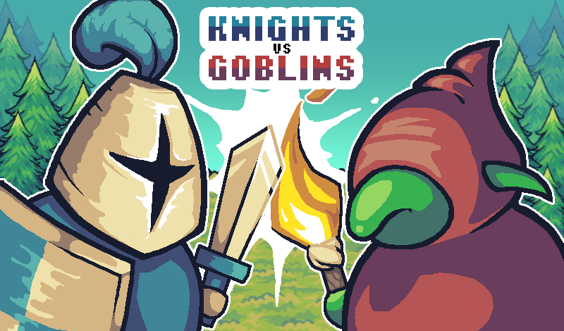
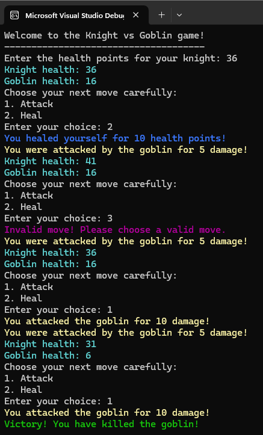

# Labo 3: Controle structuren

We gaan een applicatie maken waarin de speler als ridder tegen een goblin moet vechten. 

## Deel 1
We starten met een controle te implementeren die kijkt of de speler nog leeft.
 - Declareer en initialiseer een waarde knightHealth (0) en goblinHealth (20).
 - Indien de levenspunten van de speler (knightHealth) kleiner of gelijk zijn aan nul, dan toon je aan de speler dat hij/zij is gestorven. 
 - Doe hetzelfde voor de goblin.
 - *Extra: gebruik de Random klasse om de levenspunten van de ridder en goblin in te stellen.*

## Deel 2
 - Indien de speler niet gestorven is, dan druk je af hoeveel levenspunten (knightHealth) speler nog heeft. Gebruik hier else voor.
 - Laat de speler zelf levenspunten ingeven voor de ridder (knightHealth). Zo kiest elke speler zelf hoe moeilijk het gevecht is. 
 - De waarde knightHealth moeten tussen 0 en 100. Indien de speler een ongeldige waarde ingeeft, dan wordt de standaard waarde 100 gebruikt.
	- *Extra: gebruik TryParse om de input van de speler te verwerken, zodat het programma niet zal crashen.*
	

## Deel 3
Declareer en initialiseer een aanvalswaarde voor de ridder, attackKnight (10), en de goblin, attackGoblin (5).

Laat de speler een actie selecteren door een getal in te geven. Gebruik een switch:
 - Als ik als speler actie 1 kies, dan val ik aan en wordt attackKnight afgetrokken van goblinHealth. Beschrijf in de output wat er gebeurt.
 - Als ik als speler actie 2 kies, dan genees ik mezelf 10 levenspunten. Beschrijf in de output wat er gebeurt.
 - Als de speler een ongeldige actie ingeeft, dan weergeef je dit in de output.
 - *Extra: voeg extra acties toe die de speler kan kiezen.*
 - *Extra: zorg er voor dat de goblin ook een actie neemt.*

## Deel 4
Gebruik een for lus, zodat de speler exact 4 keer een actie kan selecteren.

## Deel 5
Vervang de for lus door een while lus die vraagt aan de speler om een actie uit te voeren zolang als de ridder of goblin nog leeft.

## Voorbeeld

